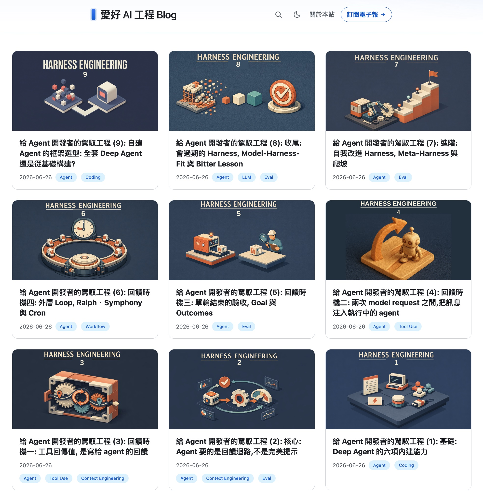
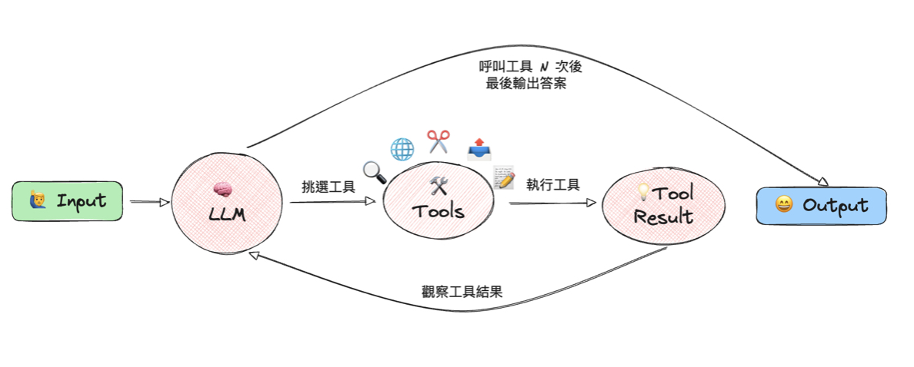
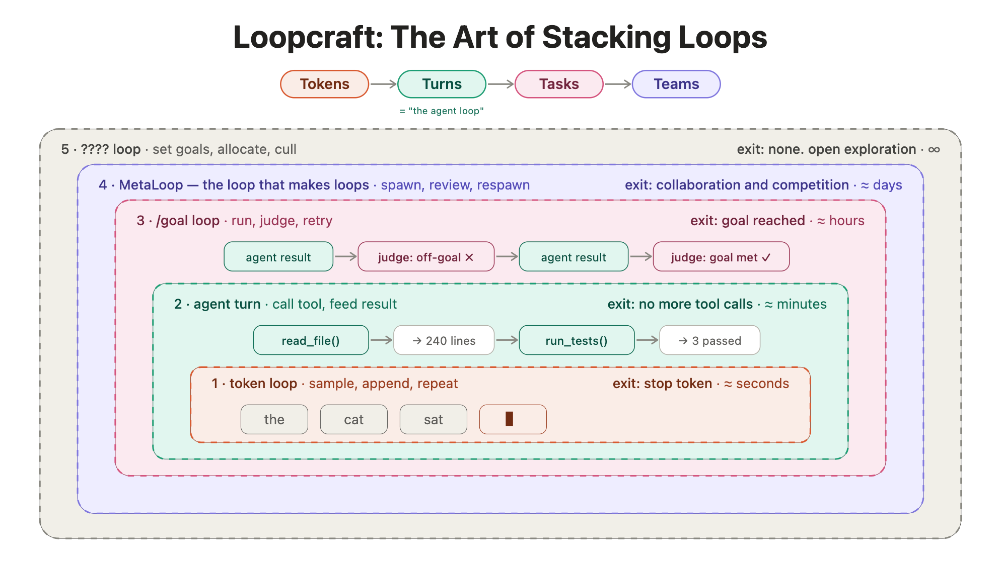

# 給 Agent 開發者的 Harness + Loop Engineering

**ihower** @ 生成式 AI 開發者年會 · 2026/6/26

> 搭配 9 篇系列文章《給 Agent 開發者的駕馭工程》，詳見 blog.aihao.tw

---

## 講者：張文鈿（ihower）

- 2002 年起從事 Web 軟體開發
- 個人部落格 <https://ihower.tw>
- 自行開業「愛好資訊科技」<https://aihao.tw>
- 經營 AI Engineer 電子報
- OpenAI Agents SDK 開源貢獻者

---

## Agenda

1. Recap: 什麼是 Deep Agent
2. 什麼是 Harness Engineering
3. 時機 ①: 工具執行內
4. 時機 ②: request 之間注入
5. 時機 ③: 單輪結束（stop hook）
6. 時機 ④: 外層 Loop
7. 進階: 自我改進的 Harness
8. 收尾: 會過期的 Harness
9. 番外: 自建 Agent 的框架選型

---

## 預期聽眾

多數談 Harness Engineering 是在講 Claude Code、Codex 來做軟體開發流程。

本場**不是**這個角度，而是站在「**自行開發 AI Agent**」的切入點。你要做的可能是 Text-to-SQL Agent、知識庫 RAG Agent，場景各式各樣，用途不一定是軟體開發。

> Harness Engineering 可以適用於**開發任何場景的 AI Agent**

---

## PART 1 · Recap: 什麼是 Deep Agent

### Agent 1.0 迴圈

呼叫工具 N 次、每次都把結果讀回來，直到沒有工具要呼叫才輸出。

### Agent 2.0 (Deep Agent) 的六項能力

這些能力讓 Agent 應付更大更複雜的任務，技術上都是用到 **Function Calling** 來實現的：

| 能力 | 做什麼 |
|---|---|
| **Plan & Todos** | 拆解大任務，依序執行 |
| **Filesystem & Bash** | 操作檔案、執行程式（搭配 sandbox） |
| **Sub-Agent** | 把耗 token 的任務分給子代理人，隔離 context |

### 內建能力 ①: Plan & Todos

透過 Function Calling 提供工具：

- 只靠 in-context 規劃，思路容易被中間步驟干擾、遺失
- 改用工具維護外部 todo list，**不會忘記**沒做完的事
- TaskCreate 建立任務項目
- TaskGet 取得任務詳情
- TaskUpdate 更新任務狀態
- TaskList 列出所有任務

### 內建能力 ②: Filesystem & Bash

透過 Function Calling 提供工具：

- Filesystem 讀寫改檔，Bash 執行任意 shell 指令
- 讓 Agent 真的動手做事：編譯、跑測試、git、裝套件
- Read／Edit／Write 讀寫檔案
- Bash 執行 CLI 指令
- Glob／Grep 搜尋檔案

### 內建能力 ③: Sub-Agent

透過 Function Calling 提供工具：

- 主 agent 派子代理去研究、查找、驗證
- 子 agent 是**獨立 context** 跑，只回精簡摘要（**context 隔離**）
- 可平行化：多個子 agent 同時工作
- 一個叫做 Agent 的工具
- 工具內就是呼叫另一個 Agent 執行，把子 agent 輸出回傳給主 agent

### 內建能力 ④: Memory

- 把重要資訊存起來，下次再開 agent，它還記得
- 例：Claude Code 的 CLAUDE.md、Codex 的 AGENTS.md、長期 memory 儲存
- Agent 一啟動就預設載入 AGENTS.md
- 使用者可以自己要求更新 AGENTS.md
- 可自行設計記憶行為：記什麼、存在哪些目錄檔案、什麼時候回憶哪些內容

### 內建能力 ⑤: Skills

- 為特定任務打包的 prompt ＋ 工具配置 ＋ 程式碼
- 不全部塞進 context，用到才載入；寫 markdown 就能新增
- 例：翻譯 skill、寫部落格 skill、處理 PDF skill
- 預設 system prompt 只載入 skills 列表
- 使用者需要某個 skill 時，Agent 才用讀檔工具載入完整 skill 內容

### 內建能力 ⑥: MCP / Browser / Computer Use

- MCP: 接外部 Slack、Gmail、Notion、自建 API…
- Browser: 瀏覽網頁、填表單、點按鈕，能上網做事或用網頁驗證自己的產出
- Computer Use: 直接操作桌面 GUI（看螢幕、移動滑鼠、敲鍵盤）
- Browser 與 Computer Use 需要多模態模型：讓 AI 看截圖判斷下一步該點哪裡
- MCP 標準化工具協議

**Deep Agent 已具備：** 能讀檔、跑指令、開子代理、記憶、用工具。

**但接下來的問題：** 這一步的產出對嗎？整個任務做完了沒？怎麼穩定地做好、做完？

---

## PART 2 · 什麼是 Harness Engineering

Anthropic 整理長時間執行 agent 的失敗模式，**第一名就是「過早宣告完成」**：

- Agent 自信地宣稱完成，但東西是壞的
- 測試沒跑、需求沒做完，它說「已全部完成」
- 你指出問題，它道歉，然後再犯

### 常見定義（太模糊）

這是網路上常見的定義：「模型以外的一切（system prompt、工具、編排、hooks）都算 harness。」

這定義有點偷懶，就像說「整體 = 核心 + 其他」。這個「其他」到底是什麼，我們需要更可以操作的技術拆解！

### 更精確的定義

Skills、Sub-Agent、Hooks、Filesystem、worktree，這些都只是手段，不是 Harness Engineering 的思維核心。

**是如何讓 agent 在執行過程能被約束、檢查、動態修正**

### 核心策略：驗證（Verification）

核心策略就是：驗證（verification），廣義的說就是**回饋（feedback）**。

agent 輸出答案 → agent 覺得「看起來沒問題」→ 就停了。

模型有自我修正的能力，但我們需要讓 Agent 順利觸發進入「輸出 → 回饋驗證 → 修正」這個流程。

### 兩個軸：方向 × 型態

Thoughtworks 用兩個軸拆解 harness 作法：

**前饋（Feed-forward）**

- 提高「一次做對」的機率
- 文件、skills、範例、架構約束
- 軟性引導，做不做最後還是要看 agent

**回饋（Feed-back）**

- 輸出之後，感測提供回饋，引導 Agent 自我修正
- 測試、linter、judge、AI review
- 用程式自動觸發，不靠 Agent 自覺

### 前饋的局限

你的 system／developer prompt，要把「什麼是好的結果」以及「驗證流程」寫清楚。例如 AGENTS.md／CLAUDE.md 都會要求 Agent 要去做驗證：

> 「非常重要：完成任務時你必須執行 lint 和 typecheck（npm run lint、ruff…），確保程式碼正確。」

但前饋終究是軟性、機率性的引導。你在 AGENTS.md 寫十遍「一定要驗證」，模型還是有可能跳過。

### 回饋的四個時機點

前饋是軟性引導；回饋則用程式自動執行，不靠模型自覺。可以插在 Agent lifecycle 的不同位置：

1. **① 工具執行內**（Part 3）
2. **② request 之間注入**（Part 4）
3. **③ 單輪結束 · Stop hook**（Part 5）
4. **④ 外層 Loop**（Part 6）

---

## PART 3 · 時機 ①：工具執行內

工具呼叫內，有三個可以設計的地方：

1. 確定性檢查參數與內容，擋掉危險或無效的呼叫
2. 對結果做品質檢查，必要時就地修復或重試
3. tool response 不只回資料，還夾帶指示與 metadata，引導 Agent 的下一步

### 案例：Text-to-SQL Agent

使用者用自然語言問財務數據，Agent 基於 DB schema 產生 SQL，用 execute_sql(sql_query) 工具查詢。

常見問題：

- 幻覺不存在的表格和欄位
- 生成查詢以外的危險語法
- 忘記分頁，回傳爆量資料
- SQL dialect 語法不同

### 讓 tool response 夾帶更多資訊

驗證沒過時，tool response 的品質決定 Agent 自我修正的能力。

不好的回傳：`{"success": true}` 或 `{"count": 0}`

好的回傳要把規模與範圍寫清楚：

- 查詢成功但 0 筆，是真的沒有結果，還是查詢不正確？
- 影響幾筆、動了哪些欄位或區塊
- 有沒有碰到不該碰的

更多資訊，Agent 才有依據判斷「這次結果合不合理」，是否要修正。

### 檢查類型

各種純運算式（Computational）的檢查，回傳的是對應的固定訊息。回事先寫死的固定字串：又快又穩又可重現。

若沒辦法用純運算式的檢查，也可用 LLM 當 judge，附上回饋的 reasoning 理由。

例如 SQL 語法驗證用 SQLGlot，又快又穩。細緻品質好不好沒有確定性 assert 可寫，使用 LLM judge 補規則型檢查的不足。

**錯誤訊息要附「該怎麼辦」，不是只丟一個程式 error code。**
工具層回饋在 tool call 內發生，要注意 latency，別拖慢整個迴圈。

### 知識庫 RAG Agent 案例

工具不只回傳搜尋結果，還可以回傳以下資訊：

- 回傳時標上來源和相關度分數，讓 Agent 有依據判斷哪些該引用、哪些該丟
- 好幾個 chunk 都來自同一份文件 → 暗示整份相關，可以指示 Agent 直接把整頁讀回來
- 回傳不只 top-k 搜尋結果，還夾帶整個資料集的統計
- 告訴 Agent：符合的不只你看到這 2 筆，還有 5 筆 Open 沒進 top-k
- 直接在工具輸出裡告訴 Agent 下一步該怎麼搜

### 注意 Context Engineering

注意控制別塞滿 context。context 過了某個門檻，模型會變笨（context rot）。

各種縮減 context 的技術：

- 硬性工具輸出上限、頭尾保留（切頭切尾）、卸載到檔案
- 關鍵字、向量檢索、reranker 等，只挑選相關的 context
- 龐大的中間過程交給 sub-agent 在獨立 context 跑，只回傳結論

### 跨模型 Review（AI-in-the-loop）

呼叫另一個模型做 review，把回饋當 tool response 帶回來。從主迴圈看，這仍是一次普通的 tool call。

例如：RAG Agent 生成答案後，用另一個模型檢查有沒有幻覺。

`/codex:review`：Claude 把本地 git 改動交給 Codex（GPT）做 code review，並說明「只做 review、不准順手改」。一個寫 code、一個分析審查。

---

## PART 4 · 時機 ②：request 之間注入

一輪（Turn）不是「一問一答」，而是「模型 request → tool calls → 模型 request → …」反覆，直到輸出答案。注入就發生在這個迴圈內部、還沒輸出答案前。

### 注入類型

**Steering（轉向／引導）**

- Agent 還在反覆呼叫工具、還沒輸出答案時，把新訊息插進去，馬上影響它接下來的動作
- 使用者主動輸入一段話介入，叫做 steering
- 在 Codex、Claude Code 這類互動式 coding agent 最常見，是內建功能

**Injection（程式注入）**

- 例如背景工具程式跑完送回結果、外部事件（webhook、告警）要讓 agent 知道
- 目前較少框架實作，少數像 Pydantic AI 做成通用機制

### 注意 API 合法性

已經發出 tool calls 但還沒拿到結果，這時若添加 user message 回傳，API 會錯誤。

正確做法：assistant 發了 tool calls → 每個 call 的結果都補齊 → 再加 user message → 下一個 request。

### Steering vs Human-in-the-Loop

**Human-in-the-loop**：你刻意設計一個等待點，讓 agent 跑到那裡停下來問你。是 agent 停下來問你。

**Steering**：agent 沒有等待點、也不打算停，是你在它還在執行時主動輸入（通常因為「需求變了」）。是你主動介入。

### Steering 的實作

**非破壞性注入**：訊息先排進佇列，等當前 tool calls 結果到齊、正要發下一個 model request 前才注入。agent 沒中斷，只是下一步多了你的訊息，已建立的 context 全部保留。

**Interrupt**：取消正在執行的工具，沒答完的 tool call 硬塞 tool_result，內容是固定字串 `aborted`，維持對話 API 合法。

### 程式注入的用途

- 長時間工具在背景跑完，把結果送回 agent
- webhook、錯誤告警、聊天平台訊息主動送進來

---

## PART 5 · 時機 ③：單輪結束（Stop Hook）

給 Agent 一個目標：讓 Agent 持續修正，直到通過為止。這是 Codex 和 Claude Code 的內建功能。

不能因為「模型覺得大概做完了」就算數。完成與否，要對著停止條件驗證，沒過就繼續做。

一個好的 Goal 包含：

- 希望的最終狀態是什麼
- 用什麼證據驗證
- 有哪些限制要遵守

好的 Goal 不一定是更長的 prompt，而是一份精簡的契約。

### 無法定義 Goal 的問題

沒有可靠的完成條件，定義不出來？那問題不在工具，**在你還不知道自己要什麼**。

模糊的 Goal 例子：「把這個變得更好」、「重構這段程式碼」

好的 Goal 需要：預期的最終狀態、驗證用的測試、要保住的限制。

### Goal 的意義

藏在 Goal 背後的，是交付物的轉變：

- 你交付的不再是一句 prompt，而是一份「目標 ＋ 邊界」的契約
- 讓 Agent 持續去跑：prompt → 判斷完成沒 → 再 prompt 讓 agent 繼續做
- 思考單位，從「一次對話 turn」換成「一輪工作 round/loop」

### 三種判定方式

**① 主模型自我審計**（Codex 做法）

- 由主模型自我審計，自己呼叫 update_goal 宣告
- 完成 = 模型呼叫 update_goal(complete)
- Agent 帶著完整的對話紀錄和推理脈絡繼續下一輪
- 判定權在主模型手上，prompt 要求逐項找證據：
  - "treat completion as unproven and verify it against the actual current state"
  - "The audit must prove completion, not merely fail to find obvious remaining work"

**② 獨立小模型裁決**（Claude Code 做法）

- 每輪結束，交給獨立的 Haiku 小模型裁決
- Claude Code 把判定交給另一個模型，把整段對話交給獨立小模型來審計（類似 fork）
- 預設 Haiku，用另一份 system prompt
- 保留對話紀錄、工具呼叫紀錄，移除 thinking、claudeMd 等
- 回覆 `{ok, reason, impossible}`，包括回饋理由，以及是否不可能辦到
- 注意：這只會看對話紀錄，審計是不會呼叫工具打開檔案、實際檢查 artifact 產出物

**③ 獨立 Grader Agent 拿 Rubric 評分**

- 由獨立的 grader agent 拿 rubric 評分標準，去檢查產出物做驗收
- Grader 在全新 context window：只拿 rubric 與產出物，看不到主 agent 的推理與敘事
- 不只「看」：而是有工具操作，可以像真實使用者實際操作 artifact（開檔、點 UI、打 API、查 DB 等）
- Rubric 逐條可評分；沒過就帶著逐條缺失進下一輪
- max_iterations 預設 3、最多 20

### 為什麼要獨立判定

要 agent 評自己做的東西，它傾向自信地稱讚，哪怕在人眼中品質明顯普通。而且 context 裡的錯誤推理會不斷累積，前面說服了自己「方向對」，後面就一路錯下去。同一個 agent 較難對自己的產出下得了手，換一個全新 context 獨立評審，比較容易做出準確的 Judge。

### 判定方式比較

| 方式 | 優點 | 適用 |
|---|---|---|
| 純自我修正 | 快、便宜 | 缺外部回饋時容易失敗 |
| 只讀文字的 judge | 好實作 | 偵測假性完成能力有限 |
| 環境／執行回饋 | 看測試與執行結果 | 不看語言宣稱 |
| rubric 分解 | 把驗收拆成逐條標準 | 中程任務 |
| Agent-as-a-Judge | 可靠度接近人類 | 長時間高價值任務 |

### 真實案例：訪談 Agent

需求：按訪綱逐題訪問用戶。挑戰：但什麼時候該換下一題？這題問夠了沒？

解法：

- 借 Claude Code 的 transcript judge 把關「這題問夠了沒」
- 借 Codex 每輪重新注入 prompt 的做法，讓訪談持續往前
- 不同題目有不同的完成標準（rubric），用小模型根據逐字稿來判斷
- Judge 回 N 時，工具不是只回一個 false，而是回一段可行動的指令，順便附上這是第幾次被退

---

## PART 6 · 時機 ④：外層 Loop

需要一個在單輪 agent 之外的工程迴圈，也就是**外層 harness**。它決定何時觸發、每件事開獨立 agent、多條 agent 怎麼協調。進度不靠 context 記憶，會寫到檔案系統共享。

使用外層 Loop 的原因：

1. **單一 context 能力有限**：大任務得拆段，每段用乾淨 context 重新開始
2. **是另一個不相關的新任務**：本來就該各自開乾淨 context，並管理多條平行的 agent
3. **要由外部事件自動觸發**：webhook、新郵件、排程、CI 失敗一來就啟動

社群近況：

- 龍蝦爸 Peter Steinberger：「你不該再去提示 agent，你該設計提示 agent 的迴圈」
- Claude 的 Boris Cherny、Andrej Karpathy 大神也講過類似的話
- 最近出現 loop engineering 新詞

### 三種 Outer Loop 模式

**1. bash 蠻力重跑**

- 每圈全新 context，同一份 prompt 反覆送進去直到做完

**2. 看板協調器**

- 專案管理工具當控制平面，每張開啟的 ticket 配一個 agent

**3. 定時觸發**

- 時間到就跑一輪；依 context 是否沿用，再分「獨立」與「heartbeat」兩種

### 案例 A：Ralph（bash 蠻力重跑）

- 一個 bash 無窮迴圈，每圈把同一份 prompt 再送進去一次
- 每一圈都是全新的 context：每圈歸零，只從固定幾份檔案重新讀起
- 完成才跳出：當 AI 認為所有任務都完成，輸出 COMPLETE，就脫離無窮迴圈

Ralph 拆成三個檔案：

- 完成的工作就是 commit，新 agent 開圈先看歷史
- 每圈追加學到的事：陷阱、模式、決策
- 任務清單與 passes 狀態：每圈挑最高優先且未完成的

Ralph 的每一圈：讀 prd.json／progress.txt → 挑最高優先尚未完成的 story → 只實作這一個 → 跑 typecheck 和測試 → 過了 commit 標記完成 → learning 追加進 progress.txt → 下一圈。

**Ralph 的限制**：無狀態重跑（progress.txt 只是軟性筆記）、暴力跑收斂困難、執行成本高。

### 案例 B：OpenAI Symphony（看板協調器）

OpenAI 開源的 harness 外層系統（以 Spec 形式）：以任務為中心，將 Linear 當做控制平面，每張開啟的 ticket 都有一個 agent 在自己工作區跑（有新 ticket 就派工）。

- ticket 狀態驅動：進 Todo 派 agent、進 Rework 帶 review 重做、進終態收掉
- 任務 DAG：沒被 block 的就開 agents 平行跑
- agent 自己開 ticket、交付 proof of work 成果（CI、review、示範影片等）
- Agent 的目標不只是「寫完 code」，而是要**「說服人類把這段程式碼合併」**

### 案例 C：定時觸發（Cron）

設定觸發條件，條件一到就自動把一段 prompt 丟出去跑一輪。Claude Code、Codex 都已內建（/loop、Routines、Automations）。

觸發類型：

- 定時：cron 排程，時間到就跑
- 動態：讓 agent 自己決定下次何時跑
- 事件：webhook、新郵件、CI 失敗才觸發

兩種模式：

- **獨立模式**：每次開全新的 agent，乾淨 context、進度靠外部狀態
- **Heartbeat 模式**：把 prompt 打到同一個長駐 session，記憶連續、反應快，但 context 會持續變大

### Steinberger 的 maintainer-orchestrator

Steinberger 開源的 maintainer-orchestrator skill，每隔 5 分鐘醒來執行：

- orchestrator 本身只當控制平面：定時檢查、派工、監控、需要時問人決策
- 每 5 分鐘 heartbeat 醒來讀各 worker 現況
- 實作全部下放給平行跑的 worker thread；worker 不准再往下委派

github-project-triage 把進來的 queue 分三類：

- **Autonomous**：可重現、有界、可驗證 → 直接派工
- **Needs owner**：產品決策、安全、缺權限
- **Defer／close**：過期、重複 → 附證據處置

### Outer Loop 設計三問

1. 固定 cron、動態間隔，還是事件（webhook、新郵件、CI 失敗、看板多一張 ticket）？
2. 要讀哪些 context 之外的狀態，才知道進度到哪、有沒有新工作？
3. 開 PR、寄一封簡報、丟進 triage 收件匣，還是安靜歸檔？

> 出自 Shawn "swyx" Wang 電子報。loop engineering 最想強調的是第 ④ 層 **MetaLoop**（生迴圈的迴圈）。

---

## PART 7 · 進階：自我改進的 Harness

連 harness 本身，都讓 agent 自己改。讓 agent 根據自己跑出來的 trace 與 eval，回頭改自己的 harness，包括 system prompt、skills 甚至 code。

**但自我改進不是讓 agent 想改什麼就改什麼。**

需要在 eval、trace、版本控制、regression test 的限制下，提出可驗證的變更。不然，「自我改進」和「把 harness 改壞」就分不出來了。

---

## PART 8 · 收尾：Model-Harness-Fit

模型每次變強，某些當初補強它的元件就不再有用，該被移除。每次升級時可以檢查之前的 prompt 約束、workflow 還有必要嗎？

Terminal-Bench 2.0 排行榜排的不是「模型」，而是「harness ＋ 模型」的配對。同一個模型配不同 harness，分數差好幾個百分點，差距甚至大過一個模型世代的升級。

- 同一套 harness 換個模型，效果不一樣
- 小模型要更複雜精巧的 harness，大模型需要的 harness 可以較輕薄

**什麼不會過期：**

- 各種 harness 做法與補強措施（Bitter Lesson：能隨算力擴大的通用方法，終究勝過手工規則）
- **定義「什麼叫做好」＋ 驗證**：就算模型強到能完美自我驗證，它驗證的，仍然是一個「由你定義的目標」。定義什麼是「好」，是無論模型多強都得自己做的核心。

Harness 應該設計得容易替換元件、更容易測量性能：模型一變強，你才拆得掉。

---

## PART 9 · 番外：自建 Agent 的框架選型

### 兩種起點

**Full Deep Agent（起點高）**

- 一開始就有能跑的 agent，但相對不好改
- 優點：馬上能跑；harness 原廠針對自家模型調過
- 缺點：會帶用不到的 context／工具；可控性／可維護性受限；常綁特定供應商

**從基礎構建（起點低）**

- 要自己接的多，但彈性與可控性好，能一步步朝想要的設計走
- 優點：完全可控，貼著任務分布拿掉無關 context／工具；model 無關、好換供應商、好控成本
- 缺點：前期工程量較大

### 常見框架

- Codex SDK / app server（Apache 2.0 開源，可用 ChatGPT 訂閱帳號登入）
- Claude Agent SDK（Anthropic）核心閉源，第三方只能用 API key
- LangChain deepagents MIT 開源
- AWS Strands Agents
- Google ADK
- Microsoft Agent Framework
- OpenAI Agents SDK
- Pydantic AI
- LangGraph

### 如何選擇

- **特定情境，或使用者多** → 從基礎構建。貼近單一任務分布的 vertical agent 更有效率
- **要打造團隊用的 harness 與 outer loop** → 從現成 deep agent
- **要的本來就是強的通用開發 agent** → 原廠已調好內層，先有能跑的東西、疊上 outer loop 最快
- **要讓使用者帶自己的 ChatGPT 帳號** → 看 Codex SDK 或 Codex app server（支援訂閱帳號登入）

---

## CONCLUSION · Takeaways

- **Part 1** ｜六項 Deep Agent 能力
- **Part 2** ｜Harness = 在執行迴圈裡約束、檢查、修正；agent 要回饋迴路，不是完美 prompt
- **Part 3 · 時機①** ｜工具裡閉合最小迴圈：驗證、改寫、回傳值夾帶指示
- **Part 4 · 時機②** ｜request 之間注入：人 steer／interrupt，或程式注入背景工具結果
- **Part 5 · 時機③** ｜單輪結束驗收 Goal／Outcomes；三種 judge 不同實作分析
- **Part 6 · 時機④** ｜外層 Loop 跨 session：Ralph／Symphony／cron，把自己移出迴圈
- **Part 7 · 進階** ｜讓 agent 自己改自己的 harness
- **Part 8 · 收尾** ｜Harness 綁模型、會過期；不過期的是 Eval 與 Judge
- **Part 9 · 番外** ｜框架兩條路：全套 Deep Agent／從基礎構建
